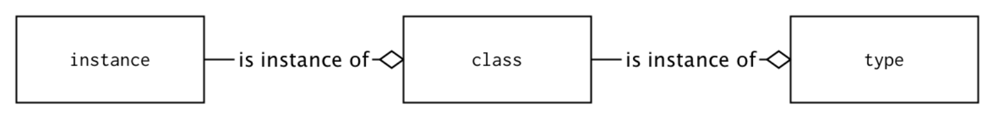
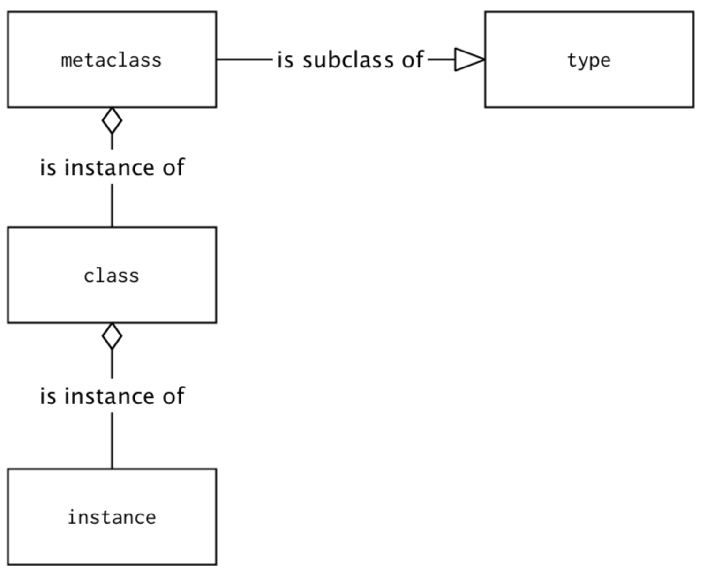

# Meta Programming

- 함수, 클래스 또는 타입과 같은 기본 요소를 검사, 작성, 수정할 수 있는 프로그래밍 기법

### Class Decorators

- 인스턴스 뿐만 아니라 클래스 객체를 런타임에 수정할 수 있다.
- 함수를 클래스 생성 시점(런타임)에 메서드로 추가할 수 있다.
- class 밖에서 supe()를 사용할 수 있다.

```python
def short_repr(cls):
    cls.__repr__ = lambda self: super(cls, self).__repr__()[10:20]
    return cls

@short_repr
class ClassWithRelativelyLongName:
    var = 'class name is long'

cl = ClassWithRelativelyLongName()
print(cl)
# ClassWithR
print(cl.var)
# class name is long
```

- 개선된 데코레이터 - 데코레이터에 매개변수를 인가하여 글자의 크기를 조절

```python
def parametrized_short_repr(max_width=8):
    def parametrized(cls):
        class ShortlyRepresented(cls):

            def __repr__(self):
                return super().__repr__()[:max_width]

        return ShortlyRepresented
    return parametrized

@parametrized_short_repr(max_width=20)
class ClassWithRelativelyLongName2:
    var = 'class name is long'

cl2 = ClassWithRelativelyLongName2()
print(cl2)
# <__main__.
print(cl2.var)
# class name is long
```

- class decorator는 @wraps를 이용해 class의 타입과 메타 데이터를 유지할 수 없다.

- 하지만, MixinClass가 필요하지만, 너무 많은 다중 상속을 허용하고 싶지 않을 경우 class decorator가 대안이 될 수 있다.

  ```python
  # 다중상속을 이용한 일반 mixin class
  class SomeConcreteClass(MixinClass, SomeBaseClass): 
      pass
  
  # class decorator
  @MixinClass(some_value)
  class SomeConcreteClass(SomeBaseClass): 
      pass
  ```

### Instance 생성 프로세스를 **new**()를 이용하여 변경(overriding)

- class instance 생성 시 가장 먼저 정적 메서드인 **new**(cls, [...]) 호출

- 이후 **init**() 메서드를 호출하여 인스턴스 초기화가 이뤄짐

  - 불변 객체(int, str, float, frozenset 등)를 생성하기 전에 수정이 필요할 경우 사용될 수 있음 - Meta Class

  ```python
  from __future__ import annotations
  
  from typing import Any, NewType
  
  NewInstance = NewType('InstanceCountingClass', Any)
  
  class InstanceCountingClass:
      instances_created = 0
  
      def __new__(cls, *args: Any, **kwargs: Any) -> NewInstance:
          print('__new__() called with:', cls, args, kwargs)
          instance: NewInstance = super().__new__(cls)
          instance.number: int = cls.instances_created
          cls.instances_created += 1
  
          return instance
  
      def __init__(self, attribute: Any) -> None:
          print('__init__() called with:', self, attribute)
          self.attribute: Any = attribute
  
  def test_func() -> None:
      instance: NewInstance = InstanceCountingClass('attr')
      instance2: NewInstance = InstanceCountingClass('attr')
      instance3: NewInstance = InstanceCountingClass('attr')
      print(instance.number, instance.instances_created)  # 0 3
      print(instance2.number, instance2.instances_created)  # 1 3
      print(instance3.number, instance3.instances_created)  # 2 3
  
  test_func()
  ```

  - instance가 생성되기 전, **new**() 메서드가 실행되면서 '**new**() called with:' 구문이 먼저 실행
  - 이후 __init__이 실행된다.
  - instances_created는 생성자에 의해 초기화되지 않으므로 새로운 인스턴스가 생성되도 값을 유지한다.

- **new**()는 다른 인스턴스를 반환할 수 있다.

- 만약 해당 클래스의 인스턴스가 아닌 다른 인스턴스를 반환할 경우 **init**() 메서드는 호출되지 않는다.

  ```python
  NonZeroCls = NewType('NonZero', int)
  
  class NonZero(int):
      def __new__(cls, value: int) -> NonZeroCls:
          return super().__new__(cls, value) if value != 0 else None
  
      def __init__(self, skipped_value: int) -> None:
          # implementation of __init__ could be skipped in this case
          # but it is left to present how it may be not called
          print("__init__() called")
          print(f"skipped value:{skipped_value}")
          super().__init__()  # int(Integer class)를 상속받기 때문에 super().__init__() 필요함
  
  def func_test2():
      print(type(NonZero(10)))  # init 호출
  		# __init__() called
  		# <class '__main__.NonZero'>
      print(type(NonZero(0)))  # init을 호출 x
  		# <class 'NoneType'>
  
  func_test2()
  ```

### Meta Class

- meta class: 다른 클래스를 정의하기 위해 사용되는 클래스

  

  type(class) → class 생성 → instance 생성



class 를 정의하기 위한 metaclass는 type의 subclass

### type syntax

**type('name', (bases), {namespace})**

- name: 클래스의 이름 -> **name** 속성에 저장
- bases: 부모 클래스의 이름 -> **bases** 속성에 저장
- namespace: 클래스 정의(속성, 메서드 등..) -> **dict** 속성에 저장

```python
def method(self):
    return 1

# 인자에 해당하는 클래스를 생성한다.
# 세번째 인자의 key: 생성될 method 이름, value: 기존의 method
MyClass = type('MyClass', (object,), {'method_': method, attr:None})
# 위 코드는 아래 클래스와 동일한 구문
# class MyClass(object):
#     def method_(self):
#         return 1

my = MyClass()
print(my.method_())  # <__main__.MyClass object at 0x103993c88>
print(my.attr)  # None
print(type(my))
print(MyClass.__mro__)
```

- 일반적으로 metaclass는 함수형이 아닌 type을 상속하는 클래스로 사용된다.

  ```python
  class Metaclass(type):
      def __new__(mcs, name, bases, namespace):
          return super().__new__(mcs, name, bases, namespace)
  
      @classmethod
      def __prepare__(mcs, name, bases, **kwargs):
          return super().__prepare__(name, bases, **kwargs)
  
      def __init__(cls, name, bases, namespace, **kwargs):
          super().__init__(name, bases, namespace)
  
      def __call__(cls, *args, **kwargs):
          return super().__call__(*args, **kwargs)
  ```

  - **new**(): 클래스 객체를 생성하기 위한 메서드
  - **prepare**(): 빈 네임스페이스(**dict**) 생성
  - **init**(): 일반 class의 생성자와 동일
  - **call**(): metaclass의 인스턴스(그림의 'class') 호출 시 사용

  ```python
  # metaclass example
  class RevealingMeta(type):
      def __new__(mcs, name, bases, namespace):
          print(mcs, "__new__ called")
          namespace['var'] = 0  # class의 정적 변수 생성
          return super().__new__(mcs, name, bases, namespace)
  
      @classmethod
      def __prepare__(mcs, name, bases, **kwargs):
          print(mcs, "__prepare__ called")
          # return super().__prepare__(name, bases, **kwargs)
          return {'a': 10}  # 빈 __dir__이 아닌 dict type을 반환
  
      def __init__(cls, name, bases, namespace):
          print(cls, "__init__ called")
          super().__init__(name, bases, namespace)
  
      def __call__(cls, *args, **kwargs):
          print(cls, "__call__ called")
          return super().__call__(*args, **kwargs)
  
  class RevealingClass(metaclass=RevealingMeta):
      def __new__(cls):
          print(cls, "__new__ called")
          return super().__new__(cls)
  
      def __init__(self):
          print(self, "__init__ called")
          super().__init__()
  
  inst = RevealingClass()
  print(dir(inst))
  print(inst.a, inst.var)
  
  """
  <class '__main__.RevealingMeta'> __prepare__ called
  <class '__main__.RevealingMeta'> __new__ called
  <class '__main__.RevealingClass'> __init__ called
  """
  
  inst = RevealingClass()
  """
  <class '__main__.RevealingClass'> __call__ called
  <class '__main__.RevealingClass'> __new__ called
  """
  print(dir(inst))
  [..., 'a', 'var']
  
  print(inst.a, inst.var)
  # 10 0
  
  """
  RevealingClass는 아래와 동일
  
  class RevealingClass:
  		var = 0
  		def __init__(self):
  				self.a = 10
  
  """
  ```